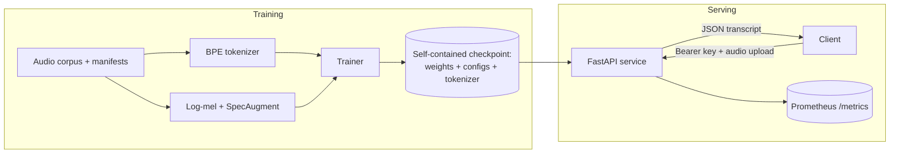

# build-your-own-whisper (WhisperLite)

A **production-grade, from-scratch Whisper-style speech recognition stack** in PyTorch: the
model, the tokenizer, the training loop, the decoder, and a hardened HTTP serving tier —
with no dependency on OpenAI's Whisper code or weights.

Everything is implemented in this repository:

| Layer | What's inside |
| --- | --- |
| **Audio front-end** | Slaney mel filterbank computed from formula, Whisper-exact log-mel normalization, SpecAugment |
| **Tokenizer** | Trainable byte-level BPE (any Unicode round-trips), fixed special-token layout, incremental-pair-count trainer |
| **Model** | Encoder–decoder transformer (conv subsampling + sinusoidal positions; causal decoder with cross-attention, tied embeddings) |
| **Decoding** | KV-cached greedy, temperature sampling, and beam search with length penalty; long-form chunked transcription |
| **Training** | Step-based trainer with AMP (bf16/fp16), grad accumulation/clipping, warmup+cosine LR, WER/CER eval, atomic self-contained checkpoints, resume |
| **Serving** | FastAPI: bearer-key auth, token-bucket rate limiting, upload/duration limits, Prometheus metrics, JSON logs, request IDs, security headers |
| **Ops** | Dockerfile (multi-stage, non-root), docker-compose, Kubernetes manifests, GitHub Actions CI, committed OpenAPI spec |



## Quickstart

Requires Python ≥ 3.10. CPU works everywhere; CUDA is auto-detected.

```bash
make install-dev            # venv + editable install with serve/dev extras
make test                   # 216 tests, ~10 s on CPU
```

### 1. Prepare data

Training reads JSONL **manifests** — one utterance per line:

```json
{"audio_filepath": "/data/clips/utt1.flac", "text": "hello world", "duration": 2.4}
```

For LibriSpeech there's a ready-made script:

```bash
python scripts/prepare_librispeech.py --root data/librispeech \
    --subset train-clean-100 --subset dev-clean
whisperlite manifest validate data/librispeech/manifests/train-clean-100.jsonl --check-audio
```

### 2. Train a tokenizer

```bash
whisperlite tokenizer train \
    --manifest data/librispeech/manifests/train-clean-100.jsonl \
    --vocab-size 8192 --output artifacts/tokenizer.json
```

### 3. Train the model

```bash
whisperlite train --config configs/train_tiny.yaml
# resume after an interruption:
whisperlite train --config configs/train_tiny.yaml --resume runs/tiny/checkpoints/step-00010000.pt
```

Metrics stream to stdout and to `runs/tiny/metrics.jsonl`; the lowest-WER model is kept
as `runs/tiny/checkpoints/best.pt`.

### 4. Evaluate and transcribe

```bash
whisperlite eval --checkpoint runs/tiny/checkpoints/best.pt \
    --manifest data/librispeech/manifests/dev-clean.jsonl
whisperlite transcribe --checkpoint runs/tiny/checkpoints/best.pt recording.wav --beam-size 4
```

### 5. Serve

```bash
export WHISPERLITE_API_KEYS="$(python -c 'import secrets; print(secrets.token_urlsafe(32))')"
whisperlite serve --checkpoint runs/tiny/checkpoints/best.pt --host 0.0.0.0 --port 8000

curl -X POST http://localhost:8000/v1/audio/transcriptions \
    -H "Authorization: Bearer $WHISPERLITE_API_KEYS" \
    -F "file=@recording.wav"
```

Or with Docker:

```bash
cp .env.example .env      # set WHISPERLITE_API_KEYS
mkdir -p models && cp runs/tiny/checkpoints/best.pt models/model.pt
docker compose up --build
```

## Repository layout

```
src/whisperlite/
├── audio/          # log-mel features, mel filterbank, SpecAugment, audio I/O
├── text/           # trainable byte-level BPE tokenizer
├── model/          # layers, encoder, decoder, generation, checkpoints
├── data/           # JSONL manifests, dataset, collation
├── training/       # trainer, LR schedules, WER/CER metrics
├── serving/        # FastAPI app, auth, rate limiting, Prometheus metrics
├── transcribe.py   # long-form chunked transcription
├── config.py       # typed configs + strict YAML loading
└── cli.py          # whisperlite train|eval|transcribe|serve|tokenizer|manifest
configs/            # ready-to-edit training configs (tiny/base)
scripts/            # LibriSpeech prep, OpenAPI export
deploy/             # Kubernetes manifests
docs/               # architecture, API, training, deployment, security, operations
tests/              # 216 tests incl. end-to-end training + live API tests
```

## Documentation

| Document | Contents |
| --- | --- |
| [docs/architecture.md](docs/architecture.md) | High/low-level design, diagrams, rationale, scalability, reliability |
| [docs/api.md](docs/api.md) | Full API reference with examples ([openapi.json](docs/openapi.json)) |
| [docs/training.md](docs/training.md) | Data prep, every config field, AMP, resume, expected results |
| [docs/deployment.md](docs/deployment.md) | Docker, Compose, Kubernetes, env-var reference, CI/CD, rollback |
| [docs/security.md](docs/security.md) | Threat model, OWASP mapping, secrets, supply chain |
| [docs/operations.md](docs/operations.md) | Runbook: monitoring, alerting, troubleshooting, upgrades |
| [docs/development.md](docs/development.md) | Dev setup, module walkthrough, testing strategy |

## Design highlights

- **Faithful Whisper front-end** — identical STFT/log-mel normalization, so intuition and
  hyperparameters transfer; the mel filterbank is derived from the Slaney formula rather
  than shipped as a binary blob.
- **Self-contained checkpoints** — one `.pt` file carries weights + model/audio config +
  tokenizer, loaded with `weights_only=True` (no pickle code execution). Ship a file, serve it.
- **Explicit KV cache** — cache objects are owned by the caller, making incremental
  decoding testable (exact-match tests against full forward) and beam reordering a single
  `index_select`.
- **Strict configuration** — YAML is deserialized into frozen dataclasses that reject
  unknown keys; derived values (vocab size, audio context) cannot silently disagree.
- **Fail-closed serving** — the server refuses to start with auth enabled and no keys;
  uploads are size-capped before they are read; every error is a stable machine-readable code.

## License

MIT — see [LICENSE](LICENSE).
