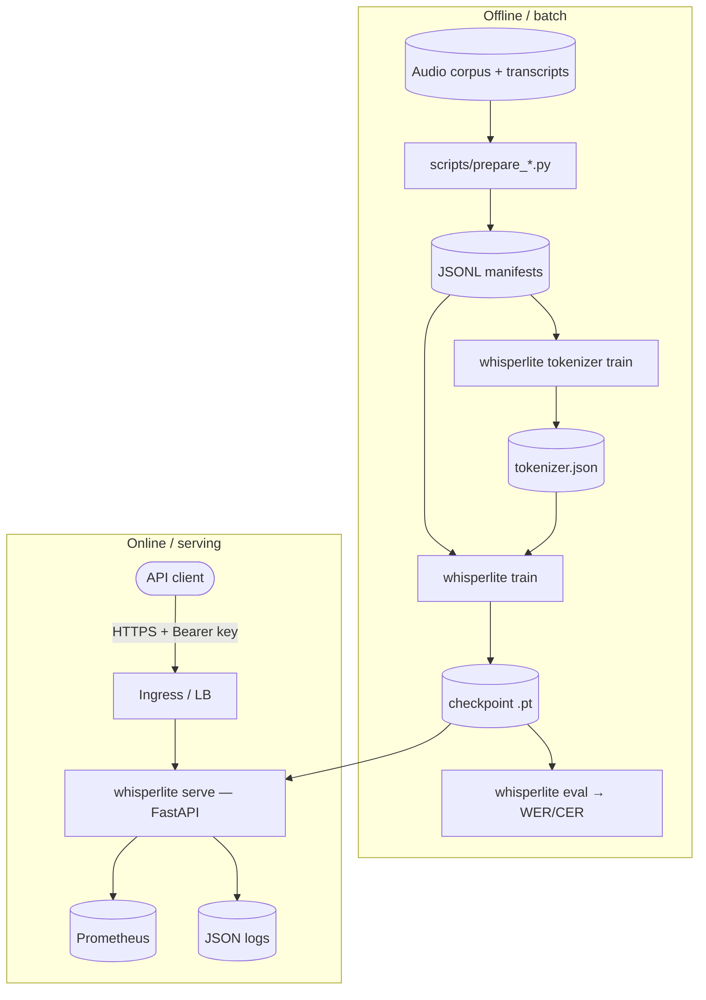
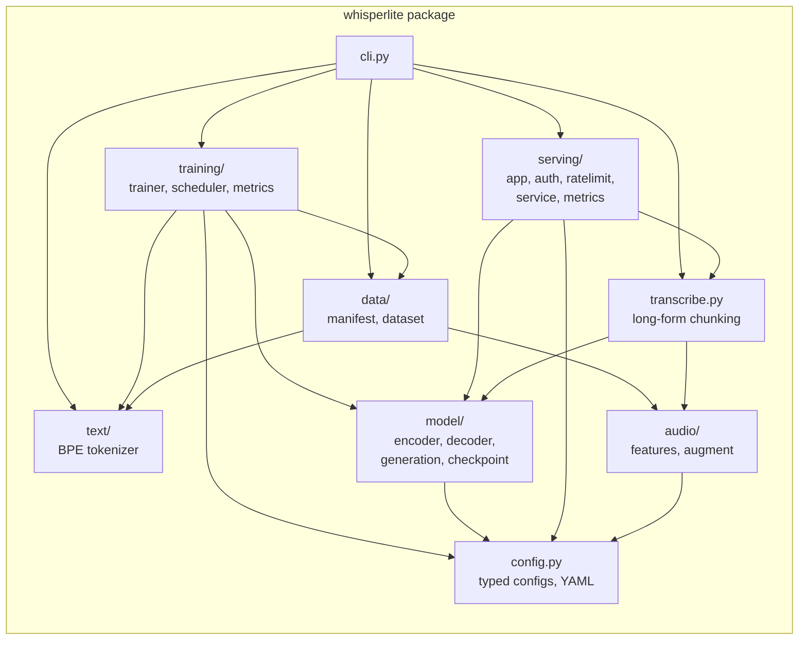
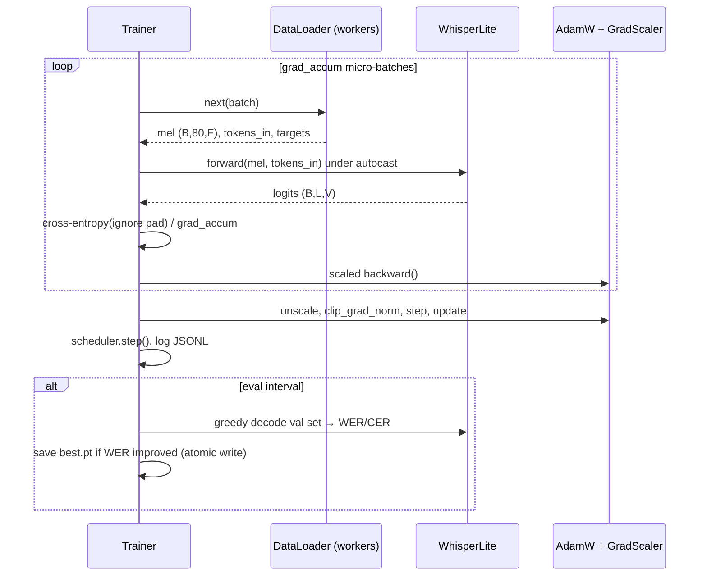
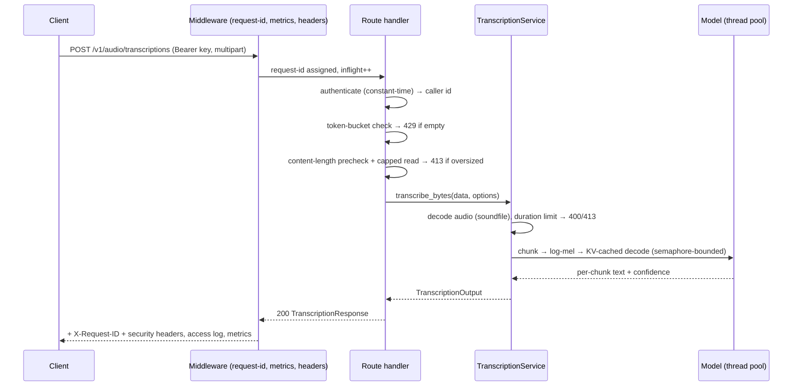
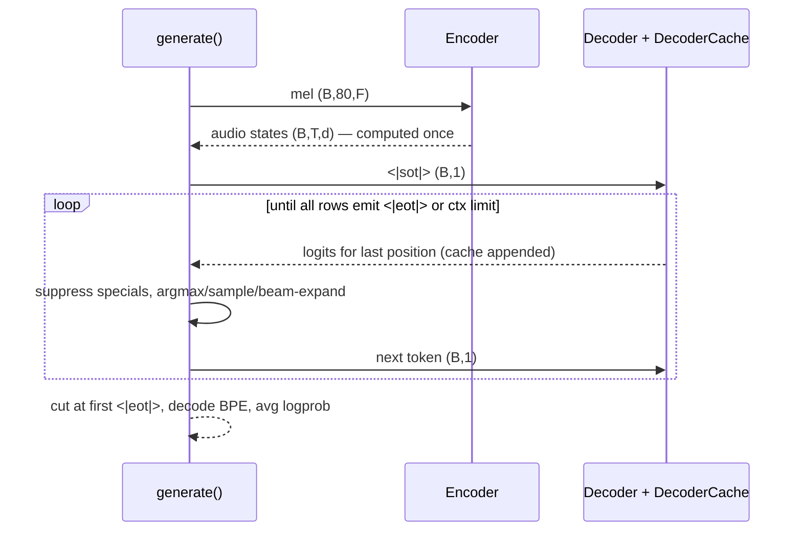
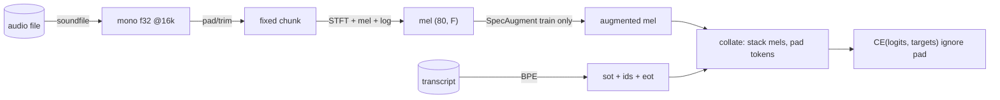
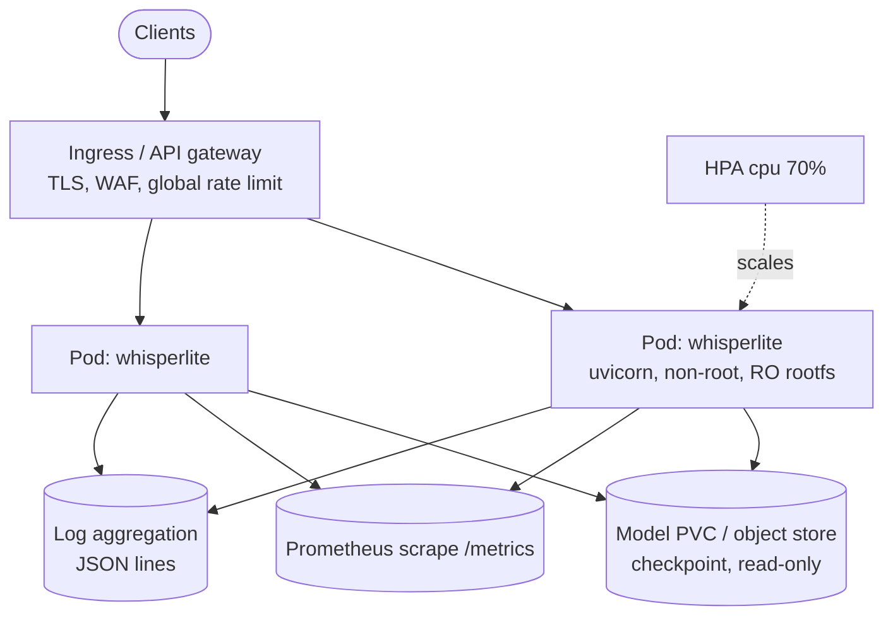

# Architecture

This document describes WhisperLite's design at every level: system context, component
structure, the neural architecture, runtime data flows, deployment topology, and the
reasoning behind each significant decision.

## 1. System context

WhisperLite is a complete automatic speech recognition (ASR) system with two runtime
personas that share one code base and one artifact format:

1. **Training** — a batch workload that turns an audio corpus into a *self-contained
   checkpoint* (model weights + model config + audio config + tokenizer in one file).
2. **Serving** — a stateless HTTP service that loads one checkpoint and transcribes
   uploaded audio.

## 2. Component architecture

Dependency rules (enforced by review, visible in imports):

* `config.py` is the leaf — everything may import it, it imports nothing internal.
* `model/` never imports `data/`, `training/`, or `serving/` — the network is reusable.
* `serving/` reaches the model **only** through `checkpoint.load_model` and
  `transcribe.transcribe_waveform`, so the HTTP layer is independent of training code.

## 3. Neural architecture

The network is a faithful Whisper-style encoder–decoder transformer, parameterized by
`ModelConfig` (`src/whisperlite/config.py`). Presets:

| Preset | Width | Heads | Enc/Dec layers | ≈ params (8k vocab) |
| --- | --- | --- | --- | --- |
| `tiny`  | 384 | 6  | 4 / 4   | ~37 M |
| `base`  | 512 | 8  | 6 / 6   | ~72 M |
| `small` | 768 | 12 | 12 / 12 | ~240 M |

### 3.1 Audio front-end (`audio/features.py`)

1. Decode to mono float32 at 16 kHz (linear resampling if needed).
2. Pad/trim to a fixed chunk (30 s default ⇒ 480 000 samples).
3. STFT: `n_fft=400` (25 ms), `hop=160` (10 ms), periodic Hann, centered; the trailing
   frame is dropped ⇒ exactly 3 000 frames.
4. Power spectrum × 80-bin Slaney-normalized mel filterbank (computed from the Slaney
   formula — validated against librosa's convention rather than shipped as a binary).
5. `log10` clamped at 1e-10, dynamic range limited to 8 dB below the per-chunk max, then
   `(x + 4) / 4` ⇒ features roughly in [-1, 1].

This is bit-for-bit Whisper's normalization, so known-good hyperparameters transfer.

### 3.2 Encoder (`model/encoder.py`)

`Conv1d(n_mels→d, k=3)` → GELU → `Conv1d(d→d, k=3, stride=2)` → GELU — halving time
resolution to 20 ms per position — then **fixed sinusoidal** position embeddings and a
stack of pre-LayerNorm blocks (`MHA → MLP(4d, GELU)`), closed by a final LayerNorm.

### 3.3 Decoder (`model/decoder.py`)

Token embedding + **learned** position embeddings (Whisper's choice: text position
distributions are learnable and short), then pre-LN blocks with *masked self-attention*,
*cross-attention over encoder states*, and an MLP. The output projection is **tied** to
the token embedding (saves `n_vocab × d` parameters and regularizes the softmax).

### 3.4 Attention & KV cache (`model/layers.py`)

All attention goes through `torch.nn.functional.scaled_dot_product_attention`, which
dispatches to FlashAttention/memory-efficient kernels when available. Incremental
decoding uses an explicit cache:

* self-attention **appends** new K/V each step (O(T) per step instead of O(T²)),
* cross-attention computes K/V from encoder states **once** and reuses them,
* the cache is a caller-owned object (`DecoderCache`), so beam search reorders beams
  with one `index_select` and tests can assert cache-vs-full-forward equality exactly.

### 3.5 Tokenizer (`text/tokenizer.py`)

Byte-level BPE with a fixed ID layout: `0=<|pad|>`, `1=<|sot|>`, `2=<|eot|>`, `3–258` the
raw bytes, then merges. Byte-level means *no unknown tokens ever*; the fixed layout means
decoding logic and loss masking never depend on the vocabulary size. The trainer
maintains pair counts incrementally (only words containing the merged pair are
re-counted), making an 8k vocabulary tractable on large corpora in pure Python.

### 3.6 Decoding (`model/generation.py`)

* **Greedy / sampling** — fully batched; finished rows keep emitting `<|eot|>` so
  tensor shapes stay static; per-token log-probs are accumulated for confidence.
* **Beam search** — per utterance, beams on the batch dimension; 2k candidates per step
  guarantee k live continuations; finished hypotheses are ranked by
  `logprob_sum / length^alpha`.
* Special tokens (and caller-supplied IDs) are suppressed by `-inf` masking, making
  invalid emissions structurally impossible rather than merely unlikely.

Sequence-level training + `<|eot|>` termination removes any need for CTC blank handling
or external alignment — the model learns to emit text and stop.

### 3.7 Long-form audio (`transcribe.py`)

Recordings longer than one chunk are split into consecutive non-overlapping windows,
decoded independently (batched for greedy), and concatenated with per-chunk timestamps.
This trades Whisper's timestamp-conditioned sliding window (which requires timestamp
tokens in the vocabulary) for simplicity; the boundary-word risk is documented and the
chunk length is configurable.

## 4. Sequence diagrams

### 4.1 Training step

### 4.2 API transcription request

### 4.3 Incremental decoding

## 5. Data flow (training)

## 6. Deployment architecture

Key properties:

* **Stateless pods** — all state is the read-only checkpoint; horizontal scaling is
  trivial and rollback is "point the Deployment at the previous image/checkpoint".
* **Per-process concurrency bound** (`WHISPERLITE_MAX_CONCURRENCY`) prevents memory
  blow-up; the HPA scales pods on CPU.
* Liveness (`/healthz`) is trivial; readiness (`/readyz`) requires the model loaded, so
  rolling updates never route to a cold pod (a `startupProbe` covers slow model loads).

## 7. Design rationale and trade-offs

| Decision | Alternatives | Why this choice |
| --- | --- | --- |
| Attention encoder–decoder (Whisper-style) | CTC (wav2vec2), RNN-T | Seq2seq gives an implicit LM, punctuation/casing for free, and no alignment machinery. CTC is cheaper to decode but needs an external LM for comparable quality; RNN-T is best for streaming, which is out of scope. |
| Byte-level BPE, own trainer | HF `tokenizers`, SentencePiece | Zero native deps, fully inspectable, guarantees the fixed special-ID layout the model/loss rely on. The incremental trainer keeps pure Python viable. |
| Fixed-size audio chunks | Variable-length batches with masks | Matches Whisper; static shapes are kernel-friendly and remove per-batch mask plumbing in the encoder. Cost: padded compute for short utterances. |
| `F.scaled_dot_product_attention` | Hand-written attention, xFormers | Fused kernels for free on every backend, no extra dependency, still supports additive masks + our cache design. |
| Self-contained checkpoints, `weights_only=True` | Separate weight/tokenizer/config artifacts | One artifact eliminates version-skew between tokenizer and weights — historically a top ASR ops bug — and closes the pickle RCE hole. |
| Step-based training loop | Epoch-based, PyTorch Lightning | Speech corpora are huge and schedules are step-defined; avoiding a framework keeps the loop ~300 readable lines and dependency-light. |
| In-process token bucket | Redis/gateway rate limiting | Correct per-replica bound with zero infra; the docs direct global limiting to the gateway where it belongs. |
| Non-overlapping long-form chunks | Timestamp-conditioned sliding window | No timestamp tokens needed in the vocab; simpler and testable. Boundary-word breakage is the accepted, documented cost. |
| Linear resampling fallback | bundling ffmpeg/scipy | Keeps the wheel pure-Python; docs recommend offline polyphase resampling for maximum fidelity. |

## 8. Performance

* **Serving latency** is dominated by decoder steps: O(tokens) matrix-vector work thanks
  to the KV cache; encoder cost is a single batched pass. Greedy on a 30 s chunk with
  `tiny` is real-time-or-better on a modern 4-core CPU.
* **Throughput** scales with `WHISPERLITE_MAX_CONCURRENCY` (PyTorch releases the GIL in
  kernels) and then with replicas. Mel filterbanks and Hann windows are LRU-cached per
  device.
* **Training** uses bf16 autocast where supported (no loss-scaling instability), fp16 +
  dynamic scaling otherwise, gradient accumulation for large effective batches, and
  pinned-memory async H2D copies on CUDA.
* Long-form transcription batches chunks (`batch_size=4` default) to amortize encoder
  launches.

## 9. Reliability, fault tolerance, disaster recovery

* **Atomic artifacts** — checkpoints and tokenizer files are written to a temp file and
  `rename()`d; a crash mid-save can never corrupt the last good artifact.
* **Resume** — optimizer, scheduler, scaler, step counter, best-WER and RNG state are in
  every periodic checkpoint; `--resume` continues bit-compatibly after preemption.
* **Checkpoint retention** — the newest K step checkpoints plus `best.pt` are kept;
  pruning never touches `best.pt`.
* **Serving isolation** — one bad request cannot poison state: decoding failures map to
  4xx, unexpected exceptions to a logged 500 envelope, and the process stays healthy.
* **DR** — the system's entire state is (corpus, manifests, config, checkpoint). Back up
  `runs/<name>/checkpoints/best.pt` + `metrics.jsonl` to object storage; restoring
  service = deploying the image with the restored checkpoint. Training restore = rerun
  from the latest step checkpoint.

## 10. Scalability and future extensibility

Scaling up quality: switch `model_preset` to `base`/`small`, raise `max_steps`, feed more
hours — no code changes. Scaling serving: raise replicas (stateless) and shard by API
key at the gateway if needed.

Designed extension points:

* **Timestamps / diarization tokens** — the tokenizer's fixed layout reserves nothing
  above the merges, so new special tokens can be appended as IDs ≥ `vocab_size` with a
  `format_version` bump.
* **Streaming** — the decoder cache is already incremental; a streaming encoder
  (chunked attention) can slot behind `embed_audio` without touching decoding.
* **Multilingual** — add a language token after `<|sot|>`; the dataset and generation
  layers take token prefixes today.
* **Quantization/ONNX export** — the model is pure `nn.Module` + SDPA, compatible with
  `torch.compile`, dynamic quantization, and ONNX export.

## 11. Cost notes

* CPU-only Docker image (~1 GB) is 5–10× smaller/cheaper than CUDA images; use it unless
  latency demands GPU.
* `tiny` at bf16 trains on a single consumer GPU (≥ 8 GB) in hours on
  LibriSpeech-clean-100; see docs/training.md for guidance.
* The HPA floor of 2 replicas is an availability choice; drop to 1 for dev clusters.
